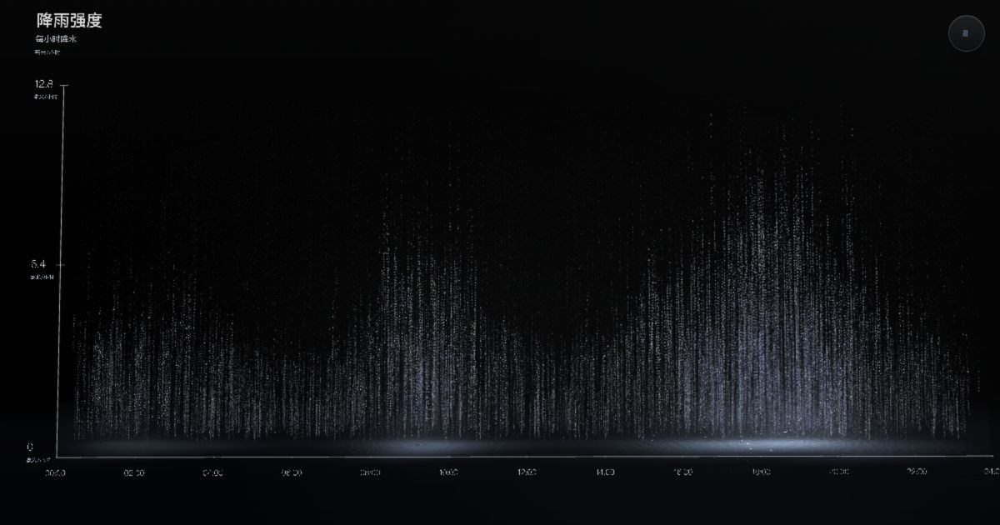

# Rainform / 数据成雨

[](https://rainform.pages.dev/)
[](https://github.com/afterimage-lab/Rainform/actions/workflows/ci.yml)
[](LICENSE)



Rainform（数据成雨）把 00:00–24:00 的 25 个逐时降雨数据点转化为实时 Three.js/WebGL 粒子雨景。用户可以拖动降雨曲线，让雨幕、峰值瀑布、水面波纹、坐标轴与雨声随数据同步变化。

Rainform turns 25 hourly rainfall values from 00:00–24:00 into an interactive Three.js/WebGL landscape. Editing the curve reshapes the rain curtain, peak waterfall, water ripples, axis system and rain audio in real time.

> **许可说明：** 本仓库源码公开可见，但只授权非商业使用，不属于 OSI 定义下允许任意商业用途的开源软件。商业使用、商业产品集成、广告或品牌项目均未获授权。

## 在线体验 / Live

- Production: <https://rainform.pages.dev/>
- Source: <https://github.com/afterimage-lab/Rainform>
- Recommended: a desktop browser with WebGL2 and hardware acceleration
- Mobile: landscape orientation; X in-app browser users may need to choose “Open in Browser”

## 功能 / Highlights

- 25 个逐时降雨数据点与实时可拖拽折线
- 数据驱动的粒子密度、瀑布、冲击、水面与坐标反馈
- 中英文界面与 X 内置浏览器启动处理
- 桌面拖拽视角、双击重置、声音切换与精确输入
- 移动端横屏门控、安全区域和方向切换恢复
- 生产环境不包含视觉调参控制台和 Source Map
- Cloudflare Pages 安全响应头与静态资源缓存策略
- 项目雨声由仓库内脚本确定性生成，不使用外部录音素材

## 本地开发 / Development

Requirements: Node.js 20 or newer.

```bash
npm ci
npm run dev
```

The local visual tuning console is enabled only in Vite development mode. It is deliberately removed from production builds.

## 构建与验收 / Build and validation

```bash
npm run check
npm run preview
```

`npm run check` validates project metadata, required notices, Chinese/English translation key parity, production build output, absence of source maps and exclusion of the development tuning console.

The bundled rain loop is generated from code with `npm run audio:generate`; it contains no third-party recording or sample.

Before a visual or interaction change is merged, test:

- 390×844 mobile portrait
- 844×390 mobile landscape
- 1366×768 desktop
- 1920×1080 desktop
- portrait → landscape → portrait → landscape
- drag, double-click reset, editor, language, sound and refresh behavior

## 项目结构 / Structure

```text
.
├── index.html              # Application shell, metadata and controls
├── src/
│   ├── bootstrap.js        # Locale, mobile gate and deferred startup
│   ├── main.js             # Three.js scene, data model and interactions
│   └── styles.css          # Responsive application styles
├── public/                 # Runtime assets and Cloudflare headers
├── scripts/                # Validation and maintainer media tools
├── docs/                   # Architecture, licensing and integration policy
└── .github/                # CI, dependency updates and contribution templates
```

See [Architecture](docs/ARCHITECTURE.md) before changing the rendering lifecycle.

## 使用与集成 / Using Rainform

Noncommercial study, modification and redistribution are permitted under the [PolyForm Noncommercial License 1.0.0](LICENSE). Every copy or derived work must retain:

```text
Required Notice: Rainform / 数据成雨 © 2026 afterimage — https://rainform.pages.dev/
```

Do not copy the minified production bundle for integration. Work from the source repository, preserve the license and notice, and keep Rainform-derived files clearly identified. Read the [integration policy](docs/INTEGRATION.md) before combining Rainform with another repository.

## 品牌 / Brand

The source license does not grant rights to use the Rainform / 数据成雨 name, logo or visual identity as the name or branding of another product. Descriptive attribution is welcome and required; implying an official fork, endorsement or partnership is not permitted without written approval. See [TRADEMARKS.md](TRADEMARKS.md).

## 贡献与安全 / Contributing and security

- Contribution guide: [CONTRIBUTING.md](CONTRIBUTING.md)
- Security reports: [SECURITY.md](SECURITY.md)
- Release history: [CHANGELOG.md](CHANGELOG.md)
- Third-party notices: [THIRD_PARTY_NOTICES.md](THIRD_PARTY_NOTICES.md)

## 许可 / License

Copyright © 2026 afterimage.

Source is available under the [PolyForm Noncommercial License 1.0.0](LICENSE). Commercial use is not permitted. See [COMMERCIAL_USE.md](COMMERCIAL_USE.md) for practical examples.
