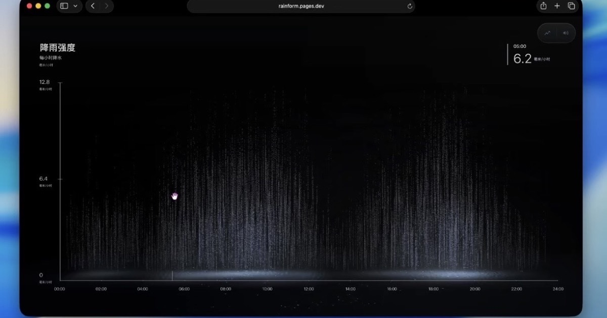

# Rainform / 数据成雨

[](https://rainform.pages.dev/)
[](https://github.com/afterimage-lab/Rainform/actions/workflows/ci.yml)
[](LICENSE)



Rainform（数据成雨）把 00:00–24:00 的 25 个逐时降雨数据点转化为实时 Three.js/WebGL 粒子雨景。用户可以拖动降雨曲线，让雨幕、峰值瀑布、水面波纹、坐标轴与雨声随数据同步变化。

Rainform turns 25 hourly rainfall values from 00:00–24:00 into an interactive Three.js/WebGL landscape. Editing the curve reshapes the rain curtain, peak waterfall, water ripples, axis system and rain audio in real time.

> **源码许可 / Source terms:** 源码仅授权非商业学习、修改与分发；禁止商业使用、商业产品集成、广告和品牌项目。Source is available for noncommercial use only and is not OSI-approved open-source software. See [LICENSE](LICENSE) and [COMMERCIAL_USE.md](COMMERCIAL_USE.md).

## 在线体验 / Live

- Experience Rainform: <https://rainform.pages.dev/>
- Best experienced in a desktop browser with WebGL2 and hardware acceleration
- Mobile devices require landscape orientation

## 功能 / Highlights

- 25 个逐时降雨数据点与实时可拖拽曲线 / 25 hourly rainfall values with a live draggable curve
- 数据驱动的粒子雨幕、峰值瀑布、水面波纹、坐标轴与雨声 / Data-driven rain, waterfall, water, axes and sound
- 桌面端视角拖拽、双击重置、声音切换与精确数据输入 / Desktop camera, reset, sound and precise editing
- 移动端横屏适配、安全区域与方向切换恢复 / Mobile landscape, safe-area and orientation recovery
- 中英文界面 / Chinese and English interface

## 本地开发 / Development

Requirements: Node.js 20 or newer.

```bash
npm ci
npm run dev
```

## 构建 / Build

```bash
npm run check
npm run preview
```

`npm run check` validates the Chinese/English interface and production build. Contributor validation requirements are documented in [CONTRIBUTING.md](CONTRIBUTING.md).

## 项目结构 / Structure

```text
.
├── index.html              # Application shell, metadata and controls
├── src/
│   ├── bootstrap.js        # Locale, mobile gate and deferred startup
│   ├── main.js             # Three.js scene, data model and interactions
│   └── styles.css          # Responsive application styles
├── public/                 # Runtime assets and Cloudflare headers
├── scripts/                # Validation and maintainer media tools
├── docs/                   # Architecture, licensing and integration policy
└── .github/                # CI, dependency updates and contribution templates
```

## 使用与许可 / Usage and license

Noncommercial study, modification and redistribution are permitted under the [PolyForm Noncommercial License 1.0.0](LICENSE). Every copy or derived work must retain:

```text
Required Notice: Rainform / 数据成雨 © 2026 afterimage — https://rainform.pages.dev/
```

Attribution alone does not make commercial use permissible. Work from this source repository, preserve the license and notice, and read the [integration policy](docs/INTEGRATION.md) before combining Rainform with another project.

The source license does not grant rights to use the Rainform / 数据成雨 name, logo or visual identity as another product's branding. See [TRADEMARKS.md](TRADEMARKS.md).

Copyright © 2026 afterimage.

## 项目文档 / Project documentation

- Architecture: [docs/ARCHITECTURE.md](docs/ARCHITECTURE.md)
- Contribution guide: [CONTRIBUTING.md](CONTRIBUTING.md)
- Security reports: [SECURITY.md](SECURITY.md)
- Release history: [CHANGELOG.md](CHANGELOG.md)
- Third-party notices: [THIRD_PARTY_NOTICES.md](THIRD_PARTY_NOTICES.md)
